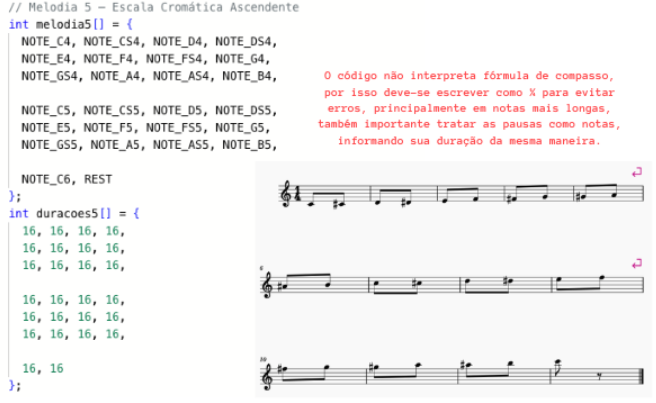
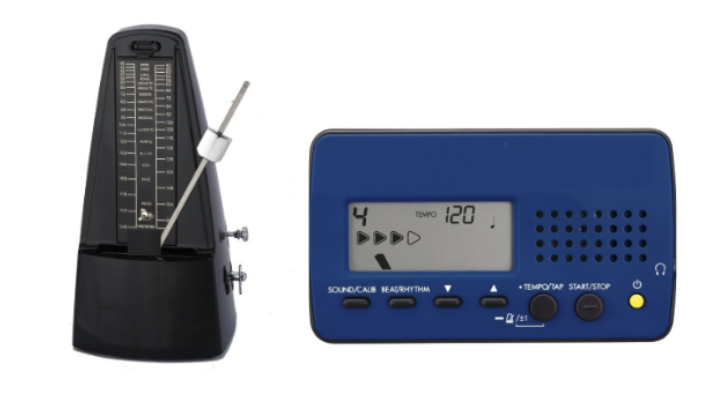
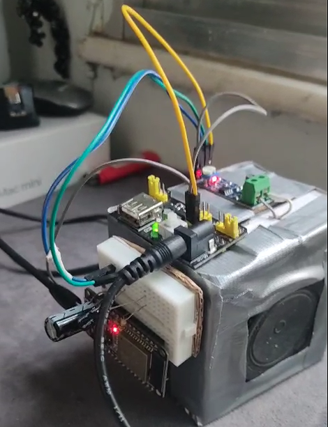

<h1 align="center">sanfoneiroo</h1>
<h3 align="center">Erwin de Mattos</h3>

Desenvolvedor de sistemas embarcados • Áudio & Música 
Professor • Acordeonista • Tecnologia Sonora

---

##  Sobre mim

Desenvolvo projetos embarcados voltados à geração sonora e aplicações musicais, integrando **eletrônica, acústica e linguagem musical**.

Atuo com **Arduino, ESP32 e Raspberry Pi**, explorando desde síntese sonora até interfaces físicas para performance musical.

Licenciatura em Música — UFRJ  
Estudante de Redes de Computadores — IBMR  

---

## Projetos em destaque

<table>
<tr>

<td align="center" width="300">
 
<b>Sistema Musical Modular</b>  
<a href="https://github.com/sanfoneiroo/melodias"> Código</a> |
<a href="https://blog.eletrogate.com/sistema-musical-modular-para-arduino-e-esp32/"> Artigo</a>
</td>
</tr>
<tr>

<td align="center" width="300">
 
<b>Metrônomo Arduino</b>  
<a href="https://github.com/sanfoneiroo/metronomo_arduino"> Código</a> |
<a href="https://blog.eletrogate.com/metronomo-arduino/"> Artigo</a>
</td>

</tr>

<tr>

<td align="center" width="300">
 
<b>WAV no ESP32</b>  
<a href="https://github.com/sanfoneiroo/wav_esp32"> Código</a> |
<a href="https://blog.eletrogate.com/reproduzindo-audio-wav-no-esp32/"> Artigo</a>
</td>
</tr>

<tr>
<td align="center" width="300">
<b>Monitor Bluetooth ESP32</b>  
<a href="https://github.com/sanfoneiroo/AudioMonitor_ESP32"> Código</a>
</td>
</tr>

<tr>
<td align="center" width="300">
<b>Controlador MIDI RP2040</b>  
<a href="https://github.com/sanfoneiroo/livecoding"> Código</a>
</td>
</tr>

</table>

  

---

---

## Contato

[LinkedIn](https://www.linkedin.com/in/erwin-de-mattos-3a0168366/)  
[Instagram](https://www.instagram.com/erwin.acordeon/)  